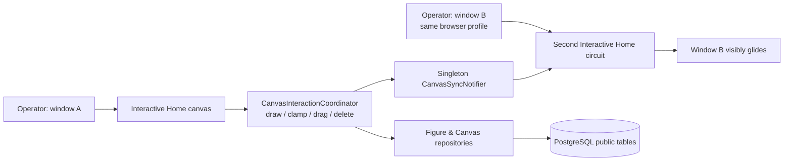

# Phase 12: Regression Verification - Research

**Researched:** 2026-07-22  
**Domain:** Human visual and two-window regression acceptance for a Blazor Server SVG canvas  
**Confidence:** HIGH

## Summary

Phase 12 is an acceptance-only phase for REG-01, not an implementation phase. The Phase 11 verifier has already passed the build, the complete 296-test suite, final-public persistence, and two-circuit protocol tests; what remains is a human’s visual confirmation that the storage rewrite is invisible in the running application. [VERIFIED: `.planning/phases/BC-11-renderer-sync-cutover/11-VERIFICATION.md`]

Use one deliberately new test account, two normal browser windows in the **same browser profile**, and the local `https` launch profile. This makes test data isolated, lets both windows share the session cookie, and exercises the singleton in-process notifier that is the live-sync boundary. Do not use an incognito/private window, a second app process, direct database mutation, new UI features, browser automation, or any code/schema change. [VERIFIED: `src/BlazorCanvas/Components/Pages/Login.razor`; `src/BlazorCanvas/Program.cs`; `src/BlazorCanvas/Sync/CanvasSyncNotifier.cs`]

**Primary recommendation:** plan one human-run acceptance script with automated preflight, evidence capture, a deterministic four-shape canvas, a two-window slow-drag observation, and UI-only cleanup.

## Architectural Responsibility Map

| Capability | Primary Tier | Secondary Tier | Rationale |
|---|---|---|---|
| Human input, selection, draw preview, and visual comparison | Browser / Client | Blazor Server circuit | Pointer events enter the InteractiveServer canvas; the operator judges visible behavior. [VERIFIED: `Home.razor`] |
| Drawing, dragging, deletion, throttled sync, and rollback state | API / Backend | Browser / Client | `CanvasInteractionCoordinator` owns circuit state and invokes persistence/sync delegates. [VERIFIED: `CanvasInteractionCoordinator.cs`] |
| Cross-window in-process delivery | API / Backend | Browser / Client | `CanvasSyncNotifier` is registered singleton and routes messages by user id. [VERIFIED: `Program.cs`; `CanvasSyncNotifier.cs`] |
| Durable figures/canvas and cutover state | Database / Storage | API / Backend | Npgsql repositories use final `public` v1.11 tables after startup cutover. [VERIFIED: `V11Cutover.cs`; `CanvasRepository.cs`] |

<phase_requirements>
## Phase Requirements

| ID | Description | Research Support |
|---|---|---|
| REG-01 | A human confirms all four shapes, edge clamping, dragging, deleting, selection, and two-window live glide are indistinguishable from v1.1. | The executable acceptance sequence below covers each visible behavior, names pass/fail evidence, and preserves a clean test account. [VERIFIED: `.planning/REQUIREMENTS.md`; `.planning/ROADMAP.md`] |
</phase_requirements>

## Standard Stack

### Core

| Component | Version | Purpose | Why Standard |
|---|---|---|---|
| .NET SDK / ASP.NET Core | SDK 10.0.301 installed; project targets `net10.0` | Runs the local Blazor application. [VERIFIED: local `dotnet --version`; `BlazorCanvas.csproj`] | Existing runtime; no replacement or installation belongs in acceptance work. |
| Docker Compose + PostgreSQL | Docker 29.1.3; `postgres:17` service | Keeps the local `canvas` database available on host port 5433. [VERIFIED: `docker compose ps`; `docker-compose.yml`] | The existing project database is required for the real persistence and sync path. |
| Browser, same profile, two windows | Operator-provided | Renders SVG and provides two independent Blazor circuits that share the session. [VERIFIED: `Home.razor`; `CanvasSyncNotifier.cs`] | It is the only suitable surface for REG-01’s human visual verdict. |

### Supporting

| Component | Purpose | When to Use |
|---|---|---|
| `dotnet build BlazorCanvas.sln --nologo -v q` | Compile preflight | Before opening the application. [VERIFIED: `.planning/config.json`; Phase 11 verification] |
| `dotnet test BlazorCanvas.sln --nologo` | Automated regression preflight | Before the manual acceptance run; this is the configured full-suite command. [VERIFIED: `.planning/config.json`; Phase 11 verification] |
| `dotnet run --project src/BlazorCanvas --launch-profile https` | Start one local application process | Keep it running for both browser windows. The configured HTTPS URL is `https://localhost:7281`. [VERIFIED: `launchSettings.json`] |

**Installation:** none. This phase must not add packages, test frameworks, or browser automation. [VERIFIED: phase goal/scope in `.planning/ROADMAP.md`]

## Architecture Patterns

### Live acceptance path



The two windows must connect to one application process. The notifier is an in-memory singleton, so opening a second browser against a second `dotnet run` process would not test the intended cross-window delivery. [VERIFIED: `Program.cs`; `CanvasSyncNotifier.cs`]

### Required execution pattern: isolated, UI-only test data

1. Create a fresh username such as `bc12-regression-20260722-<time>` and a non-sensitive disposable password. A new username creates an account; usernames are normalised and persisted. [VERIFIED: `Login.razor`; `.planning/PROJECT.md`]
2. Use the same browser profile for the second window and open the same local URL. Confirm it shows the same initially empty canvas without another login prompt; it should reuse the session cookie. [VERIFIED: `Login.razor`; `Program.cs`]
3. Do all data setup through the toolbar and canvas only. Do **not** delete database rows, run ad-hoc SQL, reset Docker volumes, or reuse a real user’s account; any of those can destroy or mask unrelated evidence. [VERIFIED: `docker-compose.yml`; Phase 12 scope in `.planning/REQUIREMENTS.md`]
4. On a passing run, select and delete every test figure using the UI. The otherwise-empty throwaway user/canvas may remain; that is the least destructive cleanup. On a failure, preserve the figures, screenshots, timestamp, and app console output until triage decides what to do. [VERIFIED: `Toolbar.razor`; `CanvasInteractionCoordinator.cs`]

### Exact manual acceptance sequence

Use browser zoom 100% and keep both windows visible if possible. The canvas is 1472 × 828 with its top edge directly beneath the 48px toolbar. [VERIFIED: `CanvasBounds.cs`; `CanvasCoordinates.cs`; `Home.razor`]

| Step | Operator action | Pass evidence | Fail evidence |
|---|---|---|---|
| 0 | Capture a screenshot of both empty windows, plus the terminal that started one app process. | Same account, empty white canvas, six tool buttons, no error/reconnect UI. | Different accounts/canvases, a startup error, or a second app process. |
| 1 | In window A, draw a clearly diagonal **line** in the upper-left open area. | A black diagonal line appears in both windows, preserving the drawn direction; it remains after a refresh. | It is absent, reversed/corrupted, or appears only locally. |
| 2 | Draw a non-square **rectangle** in the upper-middle open area, drag from top-left to bottom-right. | A black unfilled rectangle of the intended width/height appears in both windows. | It is absent, becomes a line, has the wrong extent, or differs between windows. |
| 3 | Draw a **circle** in the upper-right open area: press at its intended centre, then drag horizontally outward. | A true circle appears in both windows, not an oval or square. | Oval/square geometry, absence, or mismatch across windows. |
| 4 | Draw an upright **triangle** in a lower open area: drag a non-zero width and height. | Three-sided outlined triangle appears in both windows. | Missing, degenerate, or mismatched triangle. |
| 5 | With the circle tool armed, press near a canvas corner/edge and drag outward. | The circle remains entirely within the canvas; its radius is visibly constrained by the near edge. | Any part is drawn outside the canvas or the draw causes an error. |
| 6 | Switch to Pointer. Drag the rectangle well past the right edge, then continue moving it vertically while holding the pointer near that edge. | The rectangle stops at the inclusive edge and slides vertically rather than resizing, sticking, or crossing the boundary; window B shows the same movement. | It crosses an edge, changes shape/size, cannot slide, or windows diverge. |
| 7 | Drag each remaining non-edge-test figure a visible distance in open space, one at a time. | Every figure translates as a whole, retains its geometry, stays selected after a drag, and persists after refreshing either window. | Geometry changes, a move disappears, a stale copy remains, or refresh loses it. |
| 8 | Selection exercise: click each visible figure; then deselect via blank canvas, arming any shape tool, and clicking a non-Delete toolbar control. | Exactly one selected figure has a topmost white-underlay / blue dashed trace; every documented deselect route removes it. | Red outline, multiple traces, no trace, trace blocks input, or a deselect route fails. |
| 9 | In window A select one figure and drag it slowly for about 2–3 seconds through several intermediate positions; watch window B continuously. | Window B visibly **glides** through intermediate locations in real time, then finishes at A’s final position. Capture before/during/after screenshots or a short screen recording. | B only jumps at pointer-up, lags indefinitely, displays a different final position, or a duplicate appears. |
| 10 | Delete a selected figure in window A with the Delete toolbar button; refresh window B after the remote disappearance. | It disappears in both windows and remains absent after refresh; the Delete button is disabled when nothing is selected. | It remains/rematerialises, wrong figure disappears, or deletion affects only one window. |

## Don’t Hand-Roll

| Problem | Don’t Build | Use Instead | Why |
|---|---|---|---|
| Visual acceptance | New browser automation, DOM probes, or a second test harness | A documented human two-window run with screenshots/screen recording | REG-01 explicitly requires human confirmation, and automated Phase 11 coverage already proves protocol/persistence behavior. [VERIFIED: `.planning/REQUIREMENTS.md`; `11-VERIFICATION.md`] |
| Test isolation/cleanup | SQL purge scripts or Docker-volume resets | Fresh disposable account + in-app deletion | Avoids destructive access to other users’ data and checks the actual delete path. [VERIFIED: `Login.razor`; `Toolbar.razor`] |
| Live sync setup | Two servers or private/incognito sessions | Two normal windows from one browser profile against one local process | The app’s notifier is process-local and the normal profile shares the session cookie. [VERIFIED: `Program.cs`; `CanvasSyncNotifier.cs`] |

## Common Pitfalls

- **Starting more than one app process:** the singleton notifier does not cross process boundaries, yielding a false sync failure. [VERIFIED: `CanvasSyncNotifier.cs`]
- **Using different accounts or a private window:** it can create a distinct session/canvas and invalidate the two-window comparison. [VERIFIED: `Login.razor`; `CanvasRepository.cs`]
- **Testing only the final drag location:** REG-01 needs visible intermediate glide; make the drag slow enough to observe multiple updates. The coordinator throttles publication at 50 ms and guarantees a trailing update. [VERIFIED: `CanvasInteractionCoordinator.cs`; `11-VERIFICATION.md`]
- **Drawing zero-size shapes:** those are intentionally rejected; use clear, non-zero gestures for the four-shape acceptance cases. [VERIFIED: `FigureInputGateway.cs`; `LineShape.cs`; `RectangleShape.cs`; `CircleShape.cs`; `TriangleShape.cs`]
- **Deleting failed-run evidence:** do not clean up a failure before it is recorded. Preserve browser/app evidence and report the first divergent step. [ASSUMED]
- **Turning acceptance into feature work:** rotation, vertex editing, z-order controls, style controls, new shapes, and toolbar changes remain out of scope even though the storage model now permits them. [VERIFIED: `.planning/REQUIREMENTS.md`; `docs/DECISIONS.md` D-69]

## Automated Preflight and Evidence Gate

Run these commands before the manual sequence; do not treat a manual pass as permission to skip them.

```powershell
docker compose up -d --wait
dotnet build BlazorCanvas.sln --nologo -v q
dotnet test BlazorCanvas.sln --nologo
dotnet dev-certs https --check --trust
dotnet run --project src/BlazorCanvas --launch-profile https
```

The inspected machine has .NET SDK 10.0.301, Docker 29.1.3, a healthy `canvas-postgres` container on 5433, and a trusted development HTTPS certificate. [VERIFIED: local environment probe, 2026-07-22] The local launch profile publishes `https://localhost:7281` and `http://localhost:5054`; use the HTTPS URL after the certificate preflight. [VERIFIED: `launchSettings.json`] Microsoft’s current guidance supports checking/trusting the local development certificate with `dotnet dev-certs https --check --trust`. [CITED: https://learn.microsoft.com/en-us/aspnet/core/security/enforcing-ssl?view=aspnetcore-10.0]

**Acceptance evidence package:** retain the build/test output, startup URL, disposable username (never a sensitive password), a completed pass/fail checklist, and screenshots/video for the initial state, four-shape state, selection trace, edge slide, mid-glide, and delete/refresh result. Mark REG-01 passed only when every row succeeds; otherwise mark it failed with the exact step and evidence, with no implementation fix attempted in this phase. [VERIFIED: `.planning/REQUIREMENTS.md`; `.planning/ROADMAP.md`]

## Environment Availability

| Dependency | Required By | Available | Version / state | Fallback |
|---|---|---|---|---|
| .NET SDK | build, test, and run | ✓ | 10.0.301 | None; required. [VERIFIED: local probe] |
| Docker Compose / PostgreSQL | live persistence | ✓ | Docker 29.1.3; `canvas-postgres` healthy on 5433 | Start with `docker compose up -d --wait`. [VERIFIED: local probe] |
| HTTPS development certificate | HTTPS launch profile | ✓ | trusted localhost certificate | Use `http://localhost:5054` only if HTTPS remains blocked, and record that deviation. [VERIFIED: local probe; `launchSettings.json`] |
| Two browser windows | human glide observation | operator required | not probed | Use one browser/profile and one local app process. [VERIFIED: runtime architecture inspection] |

**Missing dependencies with no fallback:** None detected for planning.  
**Missing dependencies with fallback:** None detected for planning.

## Security Domain

| ASVS Category | Applies | Regression control |
|---|---|---|
| V2 Authentication | Yes | Use a disposable test account; do not expose an existing user’s credentials in evidence. [VERIFIED: `Login.razor`] |
| V3 Session Management | Yes | Same browser profile is intentional because session cookies make window B authenticate as the test user. [VERIFIED: `Login.razor`; `Program.cs`] |
| V4 Access Control | Yes | Confirm only the selected throwaway user’s canvas is used; do not test by altering other users’ data. [VERIFIED: `CanvasRepository.cs`] |
| V5 Input Validation | No new input surface | No change; existing input gateway is preflight-covered by the full suite. [VERIFIED: `11-VERIFICATION.md`] |
| V6 Cryptography | No phase change | Do not change certificates, auth, or password storage during this acceptance phase. [VERIFIED: phase scope] |

## Assumptions Log

| # | Claim | Section | Risk if Wrong |
|---|---|---|---|
| A1 | The operator can preserve failure evidence before cleanup. | Common Pitfalls | Low; it only affects diagnosis quality, not product behavior. |

## Open Questions

None blocking. The human operator’s actual pass/fail observations are intentionally deferred to execution; planning cannot supply them.

## Sources

### Primary (HIGH confidence)

- Project requirement and scope: `.planning/REQUIREMENTS.md`, `.planning/ROADMAP.md`, `.planning/STATE.md`.
- Prior automated evidence: `.planning/phases/BC-10-storage-schema-migration-persistence-layer/10-VERIFICATION.md` and `.planning/phases/BC-11-renderer-sync-cutover/11-VERIFICATION.md`.
- Runtime/UI behavior: `src/BlazorCanvas/Components/Pages/Home.razor`, `CanvasInteractionCoordinator.cs`, `Toolbar.razor`, `FigureShape.razor`, `SelectionTrace.razor`, `Program.cs`, and `CanvasSyncNotifier.cs`.

### Secondary (MEDIUM confidence)

- [Microsoft Learn: Enforce HTTPS in ASP.NET Core](https://learn.microsoft.com/en-us/aspnet/core/security/enforcing-ssl?view=aspnetcore-10.0) — local development certificate check/trust guidance.

## Metadata

**Confidence breakdown:**
- Standard stack: HIGH — observed from the project and local environment.
- Architecture: HIGH — traced from current runtime code and Phase 11 verification.
- Pitfalls: HIGH — derived from the notifier, interaction coordinator, and locked scope; A1 is explicitly low-confidence.

**Research date:** 2026-07-22  
**Valid until:** 2026-08-21 (stable local project workflow; recheck environment state before execution).
