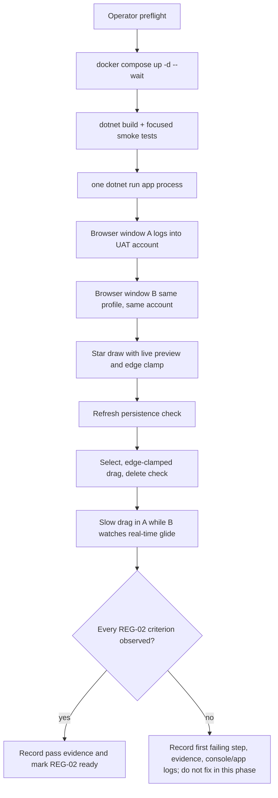

# Phase 17: Regression Verification - Research

**Researched:** 2026-07-23
**Domain:** Human UAT gate for Blazor Server SVG canvas regression verification
**Confidence:** HIGH - phase scope, prior phase evidence, tooling, and live environment were verified from repository artifacts and local probes. [VERIFIED: codebase/local probes]

## User Constraints

No `CONTEXT.md` exists for this phase, and the user explicitly chose to continue without context. [VERIFIED: `gsd-tools init.phase-op 17`; user prompt]

### Locked Decisions
None from `CONTEXT.md`. The governing constraints are REG-02, the v1.12 roadmap success criteria, and locked decisions D-70 through D-73 for `star5`. [VERIFIED: `.planning/REQUIREMENTS.md`; `.planning/ROADMAP.md`; `docs/DECISIONS.md`]

### the agent's Discretion
None from `CONTEXT.md`. Planning discretion is limited to how to structure pre-UAT smoke checks, live app setup, evidence capture, and failure handling. [VERIFIED: user prompt; `.planning/config.json`]

### Deferred Ideas (OUT OF SCOPE)
No deferred ideas from `CONTEXT.md`. Existing milestone exclusions remain out of scope: other v1.2 figures, dynamic toolbar flyout, star pointiness UI, rotation/resize handles, and unrelated tech debt. [VERIFIED: `.planning/REQUIREMENTS.md`; `.planning/STATE.md`]

## Phase Requirements

| ID | Description | Research Support |
|----|-------------|------------------|
| REG-02 | Human acceptance on the running application confirms arm, draw with live preview, edge-clamp, refresh persistence, select, drag, delete, and second-window live star glide. | Plan this as a human-run UAT gate with automated smoke checks before the browser session, one app process, same-account same-profile browser windows, screenshots/video evidence, and fail-fast issue recording. [VERIFIED: `.planning/REQUIREMENTS.md`; `.planning/ROADMAP.md`; `.planning/phases/BC-16-interaction-sync-test-guards/16-VERIFICATION.md`] |

## Summary

Phase 17 is not an implementation phase; it is the milestone acceptance gate for v1.12. The planner should create a small runbook-style plan that first proves the build and focused star regression guards are green, then starts the existing app against the existing Docker PostgreSQL database, and finally asks a human to execute the three REG-02 browser flows on the running application. [VERIFIED: `.planning/ROADMAP.md`; `.planning/REQUIREMENTS.md`; local `dotnet build`; focused `dotnet test`]

The highest-risk observation is browser-visible timing: automated tests already cover star selection, edge-clamped drag, final-public two-circuit sync, preview source ownership, bbox agreement, malformed geometry rejection, and bUnit preview rendering, but REG-02 explicitly requires the human to see the preview and the second-window glide. [VERIFIED: `.planning/phases/BC-16-interaction-sync-test-guards/16-VERIFICATION.md`; Phase 16 summaries]

**Primary recommendation:** Plan one UAT evidence package, not code changes: run preflight checks, launch one app process, use two same-profile windows on one account, perform the star script, and mark REG-02 passed only if every expected browser behavior is observed. [VERIFIED: `.planning/REQUIREMENTS.md`; `.planning/milestones/v1.11-phases/BC-12-regression-verification/12-RESEARCH.md`]

## Architectural Responsibility Map

| Capability | Primary Tier | Secondary Tier | Rationale |
|------------|--------------|----------------|-----------|
| Star toolbar arming and draw preview | Browser / Client + Blazor circuit | API / Backend | The visual gesture occurs in the SVG/Blazor UI, while the committed draw goes through `CanvasInteractionCoordinator.DrawAsync`, `FigureInputGateway`, and `FigureRepository`. [VERIFIED: `Home.razor`; `Toolbar.razor`; Phase 15 summaries] |
| Star persistence after refresh | Database / Storage | Blazor Server | The acceptance check depends on `public.figures` rows loading back through `FigureRepository` after refresh. [VERIFIED: `Program.cs`; Phase 15 summaries] |
| Star select, edge-clamped drag, delete | Blazor Server | Browser / Client | The coordinator owns selection/drag/delete behavior, while the browser shows the dashed trace and pointer interaction. [VERIFIED: `CanvasInteractionCoordinatorTests`; `SelectionTrace.razor`; `FigureShape.razor`] |
| Second-window glide | Blazor Server in-memory sync | Browser / Client | `CanvasSyncNotifier` is registered as a singleton in one app process, and two browser circuits observe the same user stream. [VERIFIED: `Program.cs`; Phase 16 verification] |
| Human acceptance verdict | Operator / UAT evidence | Planner documentation | REG-02 is satisfied by human confirmation on the running app, not by new automated implementation. [VERIFIED: `.planning/REQUIREMENTS.md`; `.planning/ROADMAP.md`] |

## Project Constraints (from AGENTS.md)

No `AGENTS.md` exists in `D:\Project1`, so there are no additional project-specific directives from that file. [VERIFIED: workspace probe]

## Standard Stack

### Core

| Library / Tool | Version | Purpose | Why Standard |
|----------------|---------|---------|--------------|
| .NET SDK | 10.0.301 | Build, test, and run the Blazor Server app. | The solution targets `net10.0`, and the installed SDK matches. [VERIFIED: `dotnet --version`; `*.csproj`] |
| Blazor Server / InteractiveServer | .NET 10 project stack | Hosts the authenticated interactive SVG canvas. | The app is a single Blazor Web App project with InteractiveServer for `/`. [VERIFIED: `Program.cs`; `Home.razor`] |
| PostgreSQL via Docker Compose | Postgres 17 image | Local persistence for the running UAT app and integration tests. | `docker-compose.yml` defines `postgres:17`, `canvas`, `postgres/postgres`, and host port 5433. [VERIFIED: `docker-compose.yml`; `docker compose ps`] |
| Npgsql EF Core provider | 10.0.3 | Database access from app and tests. | Both app and test projects reference `Npgsql.EntityFrameworkCore.PostgreSQL` 10.0.3. [VERIFIED: `src/BlazorCanvas/BlazorCanvas.csproj`; `tests/BlazorCanvas.Tests/BlazorCanvas.Tests.csproj`] |
| xUnit | 2.9.3 | Automated pre-UAT smoke tests. | Existing test project uses xUnit and the current suite passed focused smoke checks. [VERIFIED: test csproj; local focused test run] |
| bUnit | 2.7.2 | Test-only preview rendering guard. | Phase 16 added it only to the test project for component-level preview smoke coverage. [VERIFIED: Phase 16 Plan 04 summary; test csproj] |

### Supporting

| Tool | Version | Purpose | When to Use |
|------|---------|---------|-------------|
| Docker Compose | v2.40.3-desktop.1 | Start or verify local PostgreSQL. | Use before build/test/app launch if `canvas-postgres` is absent or unhealthy. [VERIFIED: `docker compose version`; `docker compose ps`] |
| Browser with two normal windows | Operator-provided | Human visual acceptance for preview, refresh, selection, delete, and glide. | Use one normal profile so the second window shares the session cookie; do not use incognito/private windows for the same-account check. [VERIFIED: `Login.razor`; `Program.cs`; prior Phase 12 research] |

### Alternatives Considered

| Instead of | Could Use | Tradeoff |
|------------|-----------|----------|
| Human UAT | New browser automation | Do not use as the phase substitute: REG-02 explicitly asks for human acceptance on the running app, and automated Phase 16 guards already cover protocol/persistence behavior. [VERIFIED: `.planning/REQUIREMENTS.md`; `16-VERIFICATION.md`] |
| One app process | Two app processes | Do not use two app processes: the notifier is an in-memory singleton, so two processes would not test the intended cross-window delivery path. [VERIFIED: `Program.cs`; Phase 16 verification] |
| Same browser profile | Private/incognito second window | Do not use private/incognito for the main gate because it can create a different auth session/account and invalidate same-account sync. [VERIFIED: `Login.razor`; `CanvasRepository` references in Phase 16 verification] |

**Installation:** none. This phase must not add packages, migrations, services, or production code. [VERIFIED: phase goal; user prompt]

**Version verification:** versions were verified from installed tools and project files: .NET 10.0.301, Docker 29.1.3, Docker Compose 2.40.3, Npgsql EF Core 10.0.3, xUnit 2.9.3, bUnit 2.7.2. [VERIFIED: local probes; `*.csproj`]

## Package Legitimacy Audit

No external package installation is planned for Phase 17. Existing packages are inherited from prior implementation/test phases; the only relevant risk is the known test-only transitive `AngleSharp` 1.4.0 NU1902 advisory emitted during build/test. [VERIFIED: local `dotnet build`; Phase 16 summaries]

**Packages removed due to [SLOP] verdict:** none; no packages are being recommended. [VERIFIED: phase scope]

**Packages flagged as suspicious [SUS]:** none; no packages are being recommended. [VERIFIED: phase scope]

## Architecture Patterns

### System Architecture Diagram



### Recommended Project Structure

```text
.planning/phases/BC-17-regression-verification/
├── 17-RESEARCH.md      # this research artifact
├── 17-01-PLAN.md       # recommended single runbook plan
├── 17-UAT.md           # recommended human checklist/evidence record
└── 17-VERIFICATION.md  # later verifier output after UAT
```

The planner should create one plan unless it wants a separate documentation-only UAT record task. The work is sequential and operator-driven, so parallel wave planning adds no value. [VERIFIED: phase scope; prior Phase 12 precedent]

### Pattern 1: Pre-UAT Automated Smoke

**What:** Run a build and focused tests before asking the human to spend time on the browser gate. [VERIFIED: local build/test]

**When to use:** Always before REG-02 UAT, because a known broken build or failed star guard invalidates human acceptance. [VERIFIED: `.planning/REQUIREMENTS.md`; Phase 16 verification]

**Example:**

```powershell
docker compose up -d --wait
dotnet build BlazorCanvas.sln --nologo
dotnet test tests\BlazorCanvas.Tests\BlazorCanvas.Tests.csproj --no-build --nologo --filter "FullyQualifiedName~CanvasInteractionCoordinatorTests|FullyQualifiedName~FinalPublicCanvasSyncIntegrationTests|FullyQualifiedName~PreviewRenderSmokeTests|FullyQualifiedName~HomePreviewSourceTests"
```

The focused command passed 40/40 locally after a transient compiler lock was avoided with `--no-build`. [VERIFIED: local focused test run]

### Pattern 2: One-Process Two-Window UAT

**What:** Start one app process and open two normal windows from the same browser profile against the same URL. [VERIFIED: `Program.cs`; `launchSettings.json`]

**When to use:** For the second-window glide acceptance criterion. [VERIFIED: REG-02]

**Example:**

```powershell
dotnet run --project src\BlazorCanvas --launch-profile http
```

The `http` launch profile listens on `http://localhost:5054`; the `https` profile listens on `https://localhost:7281` and `http://localhost:5054`. [VERIFIED: `src/BlazorCanvas/Properties/launchSettings.json`]

### Pattern 3: Evidence-First Failure Handling

**What:** If the human observes a failure, preserve the first divergent step, screenshots or video, browser console output, app terminal logs, and whether refresh changes the state. [ASSUMED]

**When to use:** Any failed REG-02 step, because this phase should not silently morph into an implementation/debug phase. [VERIFIED: phase goal; prior Phase 12 failure history]

## Don't Hand-Roll

| Problem | Don't Build | Use Instead | Why |
|---------|-------------|-------------|-----|
| Acceptance verification | A new Playwright/browser automation suite | Human checklist plus existing automated guards | REG-02 is explicitly human acceptance; automated coverage already exists for star protocol and persistence paths. [VERIFIED: `.planning/REQUIREMENTS.md`; `16-VERIFICATION.md`] |
| Cross-window sync setup | A custom SignalR hub or second local app server | Existing Blazor Server circuits and `CanvasSyncNotifier` singleton in one process | The app's designed sync path is already the Blazor Server circuit plus singleton notifier. [VERIFIED: `Program.cs`; `CanvasSyncNotifier` evidence in Phase 16 verification] |
| Database setup | Manual SQL inserts for `star5` | App startup seeding through `V11Cutover.EnsureAsync` and registry-owned `figure_types` convergence | Phase 14 made startup seeding the catalog source for `star5`; manual SQL would bypass the path REG-02 should trust. [VERIFIED: `Program.cs`; Phase 14/15 summaries] |
| Visual glide evidence | Only final-position screenshots | Continuous human observation or short video during a slow drag | REG-02 requires watching a star glide live, not merely matching final coordinates. [VERIFIED: `.planning/REQUIREMENTS.md`; Phase 16 verification] |

**Key insight:** this phase tests the assembled browser experience; adding new harnesses or fixes inside the phase would weaken the acceptance signal. [VERIFIED: `.planning/ROADMAP.md`; prior Phase 12 precedent]

## Common Pitfalls

### Pitfall 1: Treating Automated Green as REG-02 Acceptance

**What goes wrong:** The plan marks REG-02 passed because Phase 16 tests passed. [VERIFIED: Phase 16 verification]

**Why it happens:** Most star behavior is covered by tests, but the requirement asks for human confirmation on the running app. [VERIFIED: `.planning/REQUIREMENTS.md`]

**How to avoid:** Make the human checklist a must-have task and require pass/fail evidence before completing the phase. [ASSUMED]

**Warning signs:** A plan with only `dotnet test` and no two-window browser script. [ASSUMED]

### Pitfall 2: Opening the Second Window in a Different Session

**What goes wrong:** Window B does not show the same canvas or sync stream, or prompts for login as a different user. [VERIFIED: `Login.razor`; `CanvasRepository` evidence in Phase 16 verification]

**Why it happens:** The app uses cookie auth and owner-derived canvas loading; different browser profiles can mean different sessions/accounts. [VERIFIED: `Login.razor`; `Home.razor`]

**How to avoid:** Use two normal windows from the same profile and one disposable UAT username/password. [ASSUMED]

**Warning signs:** Window B starts empty while window A already has committed figures, or requests a separate login unexpectedly. [ASSUMED]

### Pitfall 3: Testing Two App Processes

**What goes wrong:** Cross-window sync appears broken or untested because each process has its own singleton notifier. [VERIFIED: `Program.cs`]

**Why it happens:** `CanvasSyncNotifier` is process-local in memory. [VERIFIED: `Program.cs`; Phase 16 verification]

**How to avoid:** Run exactly one `dotnet run` process for both windows. [VERIFIED: runtime architecture inspection]

**Warning signs:** Two terminals both reporting app startup URLs for the same UAT run. [ASSUMED]

### Pitfall 4: Moving Too Fast to Observe Glide

**What goes wrong:** The human only sees start and end positions, so the glide criterion is not actually tested. [VERIFIED: REG-02]

**Why it happens:** A quick drag can look like a jump even when intermediate messages work. [ASSUMED]

**How to avoid:** Drag slowly for 2-3 seconds while watching window B and capture before/during/after or a short recording. [ASSUMED]

**Warning signs:** Evidence consists only of a final screenshot after pointer-up. [ASSUMED]

### Pitfall 5: Leaving Prior UAT Data Ambiguous

**What goes wrong:** Old shapes or old stars make it unclear which object was drawn, refreshed, selected, moved, or deleted during REG-02. [ASSUMED]

**Why it happens:** The app persists per operation and reloads the same account's canvas after refresh. [VERIFIED: D-09; `Login.razor`; `Home.razor`]

**How to avoid:** Use a fresh disposable username for the gate or explicitly delete all UAT figures at the end. [ASSUMED]

**Warning signs:** Screenshots show multiple similar stars and the checklist cannot identify the tested one. [ASSUMED]

## Code Examples

Verified command patterns for planning:

### Environment and Smoke

```powershell
docker compose up -d --wait
docker compose ps
dotnet build BlazorCanvas.sln --nologo
dotnet test tests\BlazorCanvas.Tests\BlazorCanvas.Tests.csproj --no-build --nologo --filter "FullyQualifiedName~CanvasInteractionCoordinatorTests|FullyQualifiedName~FinalPublicCanvasSyncIntegrationTests|FullyQualifiedName~PreviewRenderSmokeTests|FullyQualifiedName~HomePreviewSourceTests"
```

Source: local probes and `.planning/config.json`. [VERIFIED: local probes; `.planning/config.json`]

### Live App Launch

```powershell
dotnet run --project src\BlazorCanvas --launch-profile http
```

Source: `launchSettings.json` and prior phase setup. [VERIFIED: `src/BlazorCanvas/Properties/launchSettings.json`; prior phase summaries]

### Suggested UAT Checklist Rows

```markdown
| Step | Action | Expected | Result | Evidence |
|------|--------|----------|--------|----------|
| 1 | Arm Star, drag a visible star, and hold during movement. | Window A shows a five-point star preview following the pointer. | pass/fail | screenshot/video |
| 2 | Drag the star creation gesture beyond a canvas edge and release. | The preview/committed star clamps inside the 1472 x 828 canvas. | pass/fail | screenshot |
| 3 | Refresh window A. | The same star reappears unchanged. | pass/fail | screenshot |
| 4 | Use Pointer to select, edge-drag, and delete the star. | Selection trace follows star outline; drag clamps/slides; Delete removes it. | pass/fail | screenshot/video |
| 5 | With two same-profile windows open, slowly drag a committed star in A. | Window B shows the star gliding through intermediate positions live. | pass/fail | video preferred |
```

Source: REG-02 success criteria and prior Phase 12 UAT pattern. [VERIFIED: `.planning/REQUIREMENTS.md`; `.planning/milestones/v1.11-phases/BC-12-regression-verification/12-RESEARCH.md`]

## State of the Art

| Old Approach | Current Approach | When Changed | Impact |
|--------------|------------------|--------------|--------|
| Four original shapes only | `star5` is the fifth registry-backed shape and toolbar tool | v1.12, Phases 13-16 | REG-02 must verify star parity with existing shapes end-to-end. [VERIFIED: requirements; phase summaries] |
| JS-owned visible draw preview formulas | Registry-backed `DrawingPreviewSession` + `FigureShape`; JS is lifecycle-only | v1.12 Phase 15 | Human preview observation should see the same geometry the commit path uses. [VERIFIED: Phase 15 summaries; `Home.razor`] |
| Automated protocol proof only | Human browser acceptance is the milestone gate | v1.12 Phase 17 | Planner must not replace UAT with tests. [VERIFIED: `.planning/ROADMAP.md`] |

**Deprecated/outdated:**
- Six-button toolbar text is outdated for the active milestone; the current toolbar is seven controls with Star between Triangle and Delete. [VERIFIED: `docs/DECISIONS.md` D-73; `Toolbar.razor`]
- Any instruction to add manual SQL for `star5` is outdated; startup seeding owns catalog convergence. [VERIFIED: `Program.cs`; Phase 14 summaries]

## Assumptions Log

| # | Claim | Section | Risk if Wrong |
|---|-------|---------|---------------|
| A1 | Preserve screenshots/video and logs before debugging a failed UAT step. | Architecture Patterns / Pitfalls | Low; if wrong, the main cost is weaker failure evidence. |
| A2 | Use a fresh disposable UAT user or explicitly clean up old figures to avoid ambiguous evidence. | Common Pitfalls | Medium; old data could obscure which star satisfied REG-02. |
| A3 | Drag slowly for 2-3 seconds to make live glide visually judgeable. | Common Pitfalls / Code Examples | Low; exact duration is operator guidance, not a product requirement. |

## Open Questions (RESOLVED)

1. **Which browser/profile will the human use for UAT?**
   - What we know: The app requires two same-account browser windows for the glide gate. [VERIFIED: REG-02]
   - RESOLVED: The UAT rule is to use the same normal browser profile for both windows, avoid incognito/private mode, and keep both windows visible during the glide step. The exact browser product and screen layout remain operator choices as long as they satisfy that rule. [ASSUMED]

2. **Should the UAT evidence file be `17-UAT.md` or embedded in `17-VERIFICATION.md`?**
   - What we know: Prior Phase 12 used a dedicated UAT record consumed by verification. [VERIFIED: `.planning/milestones/v1.11-phases/BC-12-regression-verification/12-VERIFICATION.md`]
   - RESOLVED: Create `17-UAT.md` as the human checklist/evidence record for REG-02, then let `17-VERIFICATION.md` cite that file after execution. [ASSUMED]

## Environment Availability

| Dependency | Required By | Available | Version | Fallback |
|------------|-------------|-----------|---------|----------|
| .NET SDK | Build/test/run | yes | 10.0.301 | None needed. [VERIFIED: `dotnet --version`] |
| Docker | PostgreSQL runtime | yes | 29.1.3 | None needed. [VERIFIED: `docker --version`] |
| Docker Compose | PostgreSQL runtime | yes | 2.40.3-desktop.1 | None needed. [VERIFIED: `docker compose version`] |
| PostgreSQL container | Live app persistence and integration tests | yes | `postgres:17`, healthy on host 5433 | Start with `docker compose up -d --wait` if stopped. [VERIFIED: `docker-compose.yml`; `docker compose ps`] |
| BlazorCanvas app process | Browser UAT | not currently running | launch profile `http` = `http://localhost:5054` | Start with `dotnet run --project src\BlazorCanvas --launch-profile http`. [VERIFIED: process probe; `launchSettings.json`] |
| Two same-profile browser windows | Human glide observation | operator required | not probed | No equivalent fallback for REG-02. [VERIFIED: REG-02] |

**Missing dependencies with no fallback:**
- Human/operator browser run for REG-02; automated tests are not a substitute. [VERIFIED: `.planning/REQUIREMENTS.md`]

**Missing dependencies with fallback:**
- App process is not currently running; start it with the verified launch command. [VERIFIED: process probe; `launchSettings.json`]

## Validation Architecture

Skipped because `.planning/config.json` sets `workflow.nyquist_validation` to `false`. [VERIFIED: `.planning/config.json`]

## Security Domain

Security enforcement is not explicitly disabled in `.planning/config.json`, but Phase 17 does not add production code, endpoints, packages, migrations, or new trust boundaries. [VERIFIED: `.planning/config.json`; phase scope]

### Applicable ASVS Categories

| ASVS Category | Applies | Standard Control |
|---------------|---------|------------------|
| V2 Authentication | Yes, existing only | Use the existing static-SSR login and same-profile session cookie for UAT; do not change auth. [VERIFIED: `Login.razor`; `Program.cs`] |
| V3 Session Management | Yes, existing only | Same browser profile is intentional so both windows share the test user's session. [VERIFIED: `Login.razor`; REG-02] |
| V4 Access Control | Yes, existing only | Use one disposable account; canvas ownership is already handled by owner-derived canvas loading. [VERIFIED: `Home.razor`; Phase 16 verification] |
| V5 Input Validation | No new inputs | Do not add new input paths; existing `FigureInputGateway` guards star geometry. [VERIFIED: Phase 16 verification] |
| V6 Cryptography | No | No cryptographic implementation is in scope. [VERIFIED: phase scope] |

### Known Threat Patterns for This Phase

| Pattern | STRIDE | Standard Mitigation |
|---------|--------|---------------------|
| Real credentials used in a throwaway plaintext-password app | Information Disclosure | Use disposable UAT credentials only. [VERIFIED: D-08; `Login.razor`] |
| Mistaking different sessions/accounts for a sync failure | Spoofing / Test invalidity | Use two normal windows from one browser profile and record the UAT username. [VERIFIED: `Login.razor`; REG-02] |
| Editing code during the acceptance gate | Tampering / Process risk | Record failures and route fixes to a later debug/implementation task; do not modify production code inside Phase 17 planning. [VERIFIED: user prompt; phase scope] |

## Sources

### Primary (HIGH confidence)
- `.planning/REQUIREMENTS.md` - REG-02 requirement and v1.12 definition of done. [VERIFIED: codebase]
- `.planning/ROADMAP.md` - Phase 17 goal, dependencies, and success criteria. [VERIFIED: codebase]
- `.planning/STATE.md` - current phase state and completed Phase 16 transition. [VERIFIED: codebase]
- `.planning/PROJECT.md` - active milestone summary, stack, constraints, and accepted gaps. [VERIFIED: codebase]
- `.planning/phases/BC-15-draw-preview-render-persist-a-star/*-SUMMARY.md` - draw, preview, render, persist evidence and G-15-1 closure. [VERIFIED: codebase]
- `.planning/phases/BC-16-interaction-sync-test-guards/*-SUMMARY.md` and `16-VERIFICATION.md` - interaction, sync, and test guard evidence. [VERIFIED: codebase]
- `docs/DECISIONS.md` - D-70 through D-73 star decisions, D-53 sync contract, D-36 clamp, and D-08 auth warning. [VERIFIED: codebase]
- `docker-compose.yml`, `launchSettings.json`, `*.csproj`, `Program.cs`, `Home.razor`, `Toolbar.razor`, `FigureShape.razor`, `SelectionTrace.razor` - runtime setup and implementation seams. [VERIFIED: codebase]
- Local probes: `dotnet --version`, `docker --version`, `docker compose version`, `docker compose ps`, `dotnet build`, focused `dotnet test`. [VERIFIED: local probes]

### Secondary (MEDIUM confidence)
- `.planning/milestones/v1.11-phases/BC-12-regression-verification/12-RESEARCH.md` and `12-VERIFICATION.md` - prior regression-gate precedent. [VERIFIED: codebase]

### Tertiary (LOW confidence)
- Operator evidence handling guidance where not prescribed by project docs. [ASSUMED]

## Metadata

**Confidence breakdown:**
- Standard stack: HIGH - verified from installed tools, project files, and local probes. [VERIFIED: local probes; codebase]
- Architecture: HIGH - verified from implementation files and Phase 16 verifier evidence. [VERIFIED: codebase]
- Pitfalls: MEDIUM - core risks are verified from prior phase history and architecture; evidence-capture practices include operator assumptions. [VERIFIED: codebase; ASSUMED]

**Research date:** 2026-07-23
**Valid until:** 2026-08-22 for phase planning, unless app launch profiles, Docker Compose configuration, or Phase 16 verification results change. [ASSUMED]
